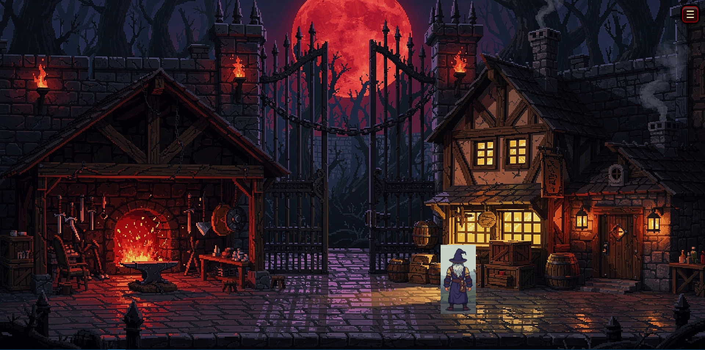

# SK Project v3 – Prototype

## A játék bemutatása

Ez a projekt egy **2D dark fantasy hangulatú, körökre osztott harcrendszerű játék**, amelyet a végső projektmunkánk részeként készítettünk.

A játékban a játékos különböző kalandokat választhat, ahol ellenségekkel találkozik, harcol velük, és fokozatosan egyre erősebbé válik.

A játékmenet egy központi **Hub** köré épül, ahonnan a játékos:

- kalandokra indulhat,
- kezelheti a felszerelését,
- küldetéseket vehet fel,
- felkészülhet a következő harcokra.

A játék célja, hogy a játékos folyamatosan fejlődjön, új kihívásokkal találkozzon, és egyre erősebb ellenfeleket győzzön le.

---

## Képek a projektről

### Combat rendszer

### Hub

### Inventory rendszer

### Bolt

### Kovácsműhely

### Küldetések

### Adatbázis

---

## Az ötlet eredete

A projekt alapötlete még tavaly született, amikor megkaptunk egy beadandó feladatot. Már ekkor eldöntöttük, hogy egy játékot szeretnénk készíteni.

Első lépésként egy egyszerű konzolos játékkal kezdtünk, ahol a játékos a nyílbillentyűk segítségével választhatott különböző ösvények közül. Az események előre meghatározottak voltak, és a játék lényegében egy történetvezérelt kalandként működött, ahol a játékos döntései befolyásolták a haladását.

A játék ötletét főként **dark fantasy hangulatú, stratégiai harcrendszerű játékok** inspirálták.

Őszintén szólva kezdetben nem volt pontos elképzelésünk, mivel korábban még nem foglalkoztunk hasonló projekttel. Az előző, egyszerű konzolos játékunk azonban nagy inspirációt adott, ezért biztosak voltunk benne, hogy egy játékot szeretnénk készíteni.

A célunk az volt, hogy létrehozzunk egy **egyszerű, de jól bővíthető rendszert**, amelyben a harcok gyorsak, ugyanakkor stratégiai döntéseket igényelnek.

---

## A projekt elkészítése

A projektet **háromfős csapatban** készítettük.

A fejlesztés során különböző technológiákat és eszközöket használtunk a **frontend, a backend és az adatkezelés** megvalósításához.

Nagy segítséget jelentett számunkra, hogy az egyik csapattársunk vizuális effektekkel foglalkozik, így a játék vizuálisan is látványosabb lett.

A fejlesztés során fontos cél volt, hogy a játék rendszerei később **könnyen bővíthetők** legyenek.

---

## Feladatmegosztás

### Mártha József

- harcrendszer
- játékos életerő számolása
- játékos pénz és XP - tapasztalati pont kezelése
- véletlenszerű események kezelése
- védekező és gyógyító kártyák rendszerének kialakítása a játékos életerőszintjéhez igazítva
- ellenségek és encounterek kezelése
- felszerelésrendszer
- küldetésrendszer
- tutorial rendszer

### Pásztor Alex

- bejelentkezési rendszer elkészítése
- jelszavak titkosítása
- beállítások panel, azon belül admin mód
- a felhasználói felület (UI) kinézetének kialakítása
- vizuális effektek megvalósítása a játék különböző részein
- a küldetések menüjének és megjelenítésének elkészítése
- loading screen létrehozása a kalandok indulása előtt
- inventory - felszerelés rendszer
- felszerelés vásárlás, és eladás

### Kovács Hunor Krisztián

- a játék kezdőképernyőjének elkészítése
- Hub rendszer
- karaktermozgás és fókuszpontok kialakítása
- kovácsműhely frontend és backend
- bolt frontend és backend
- játékos háza frontend és backend

---

## A játék fő funkciói

- körökre osztott harcrendszer
- játékos életerő kezelése
- pénz és XP - tapasztalati pont rendszer
- véletlenszerű események
- ellenség- és encounterkezelés
- felszerelésrendszer
- inventory - felszerelés rendszer
- küldetésrendszer
- tutorial rendszer
- Hub rendszer
- bolt
- kovácsműhely
- beállítások panel
- bejelentkezési rendszer

---

## Technológiák

A projekt során az alábbi technológiákat használtuk:

- **React** – frontend
- **Node.js** 
- **MySQL** – adatbázis
- **Express** - backend
- **After effects**
- **JavaScript**
- **CSS**
- **JSX**

---

## A projekt futtatása

A projekt futtatásához szükség van a frontend, a backend és az adatbázis megfelelő beállítására.

### Szükséges eszközök

- Node.js
- npm
- MySQL

**A project saját szellemi termékünk.**

<h3>
  Mártha József
  &nbsp;•&nbsp;
  Pásztor Alex
  &nbsp;•&nbsp;
  Kovács Hunor Krisztián
</h3>

<i>A projekt készítőcsapata</i>

